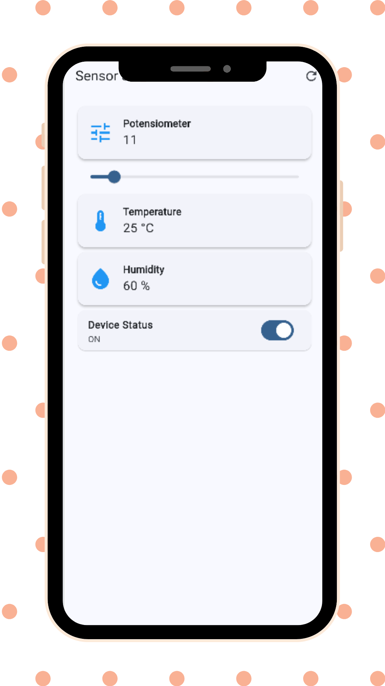

# Flutter Sensor Simulator App

Flutter Sensor Simulator App adalah aplikasi Flutter sederhana untuk mensimulasikan data sensor secara realtime tanpa backend.

Aplikasi ini dibuat untuk mempelajari dasar Flutter seperti:

- State Management
- Widget Layout
- UI Dashboard
- Struktur Project Flutter

---

## 📱 Preview Aplikasi

---

## 🚀 Fitur

- 🎚️ Potensiometer (Slider)
- 🌡️ Suhu (Random Generator)
- 💧 Kelembaban (Random Generator)
- 🔌 Status Perangkat ON/OFF
- 🔄 Refresh Data Sensor
- 📱 Responsive (Android & Web)

---

## 🛠️ Teknologi yang Digunakan

- Flutter
- Dart
- Material 3

---

## 📂 Struktur Project
